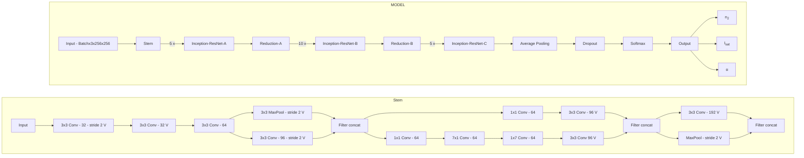
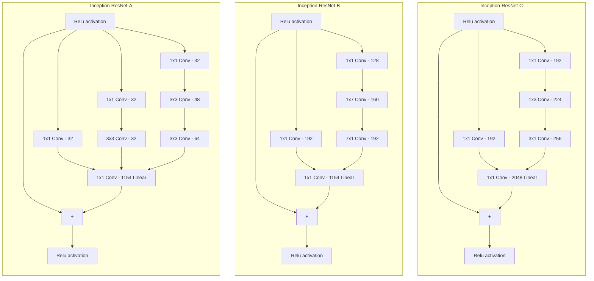
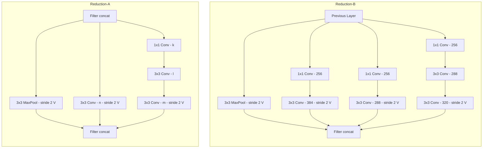
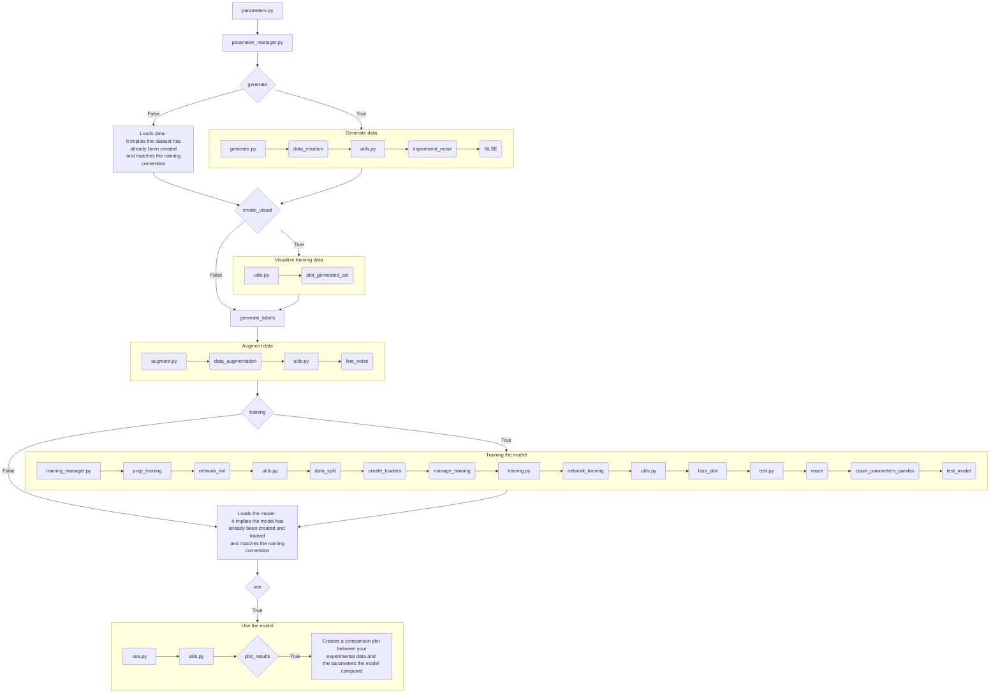

# Nonlinear Schrödinger Equation Parameter Estimation with Neural Networks

# Problem

## Physical situation

[NLSE](https://github.com/Quantum-Optics-LKB/NLSE) offers a powerful simulation tool to solve a typical [non linear Schrödinger](https://en.wikipedia.org/wiki/Nonlinear_Schr%C3%B6dinger_equation) / [Gross-Pitaevskii](https://en.wikipedia.org/wiki/Gross%E2%80%93Pitaevskii_equation) equation of the type :
$$i\partial_{t}\psi = -\frac{1}{2}\nabla^2\psi+g|\psi|^2\psi$$

In this particular instance, it can solve in the formalism of the propagation of a pulse of light in a non linear medium (here a Rubidium cell).
Within the [paraxial approximation](https://en.wikipedia.org/wiki/Paraxial_approximation), the propagation equation for the field $E$ in $V/m$ solved is:

$$
i\partial_{z}E = -\frac{1}{2k_0}\nabla_{\perp}^2 E - n_2 \frac{k_0c\epsilon_0}{2}|E|^2E - i \frac{\alpha}{2}
$$

The system holds 3 unknowns: non-linear index $n_2$, absorption $\alpha$ and saturation intensity $I_{sat}$.
Aside from $\alpha$, these parameters are coupled and cannot be measured in the experiment. They are intrinsic properties of the system.

With the recent research in machine learning and optimization tools thriving, the idea was to attempt and solve this problem with neural networks. 

# Solution

## Overview

This repository uses the Inception-Residual Network (Inception-Resnetv2) model dedicated to the estimation of parameters within the Nonlinear Schrödinger Equation (NLSE) representing the propagation of a laser beam inside a hot Rubidium vapor cell.

### Source

The code for this model is adapted from an unofficial PyTorch implementation of Inception-v4 and Inception-ResNet-v2, available at [this repository](https://github.com/zhulf0804/Inceptionv4_and_Inception-ResNetv2.PyTorch). This adaptation is inspired by the paper ["Inception-v4, Inception-ResNet and the Impact of Residual Connections on Learning" by Christian Szegedy, et al., 2016](https://doi.org/10.48550/arXiv.1602.07261).

### Inception-ResNet-v2 Model




## Workflow

1. **Create Your Setup**: Design your experimental setup.
2. **Record Output parameters**: Take note of all the parameters of your system to ensure the data you will generate will be able to represent your system.
3. **Explore the parameter space**: There is a sandpox program that allows you to tryout your generation parameters to check that your simulations converge and looks a bit like your experiment.
4. **Generate Training Data**: The data is generated using [NLSE](https://github.com/Quantum-Optics-LKB/NLSE) based on your parameters.
5. **Train the Model**: Train the model using the generated data.
6. **Estimate your parameters**: Apply the trained model to new data to estimate parameters.

## Program flowchart



# Getting Started

## Prerequisites

Ensure you have Python 3.x installed. This project requires the following external libraries:

- **NumPy**
- **Matplotlib**
- **SciPy**
- **CuPy**
- **NLSE**
- **PyTorch**
- **Cupyx**
- **Skimage**
- **tqdm**
- **Kornia**

These dependencies can be installed using mamba.

The requirements are in the requirements.txt at the root of the repo.

### Installation

Clone the repository and navigate into the project directory:

```bash
git clone https://github.com/Quantum-Optics-LKB/nlse_parameter_nn.git
cd nlse_parameter_nn
```

# Usage

The [`parameters.py`](/parameters.py) script is where you store the parameters for the data generation, training, and parameter estimation processes:

```bash
python parameters.py
```

The [`sandbox_parameters.py`](/sandbox_parameters.py) script is where you use the same parameters as for the data generation, training, and parameter estimation processes and see how the generated data would look like from your parameters. Then you can just take these parameters and put them into the [`parameters.py`](/parameters.py) script.

```bash
python sandbox_parameters.py
```
## Parameters

### <ins>Path and Device Settings<ins>
- `saving_path`: Directory where data and models will be saved.
- `device`: GPU device ID to run the code.  (default 0)

### <ins>Data Generation <ins>
When you generate the data there are two steps.
First you generate using NLSE you propagate the beam with your parameters at the given parameters. Then your data is augmented. Meaning the program adds fringes at different angles. 
This will help the model generalize the fitting of the parameters regardless of the noise.

- `generate`: Set to `True` to generate new data using NLSE.

### <ins>Data Generation Parameters using NLSE <ins>
- `cell_length`: Length of the rubidium cell (m).
- `output_camera_resolution`: Resolution of the output camera (in case not square give the smallest).
- `output_pixel_size`: Size of pixels of the output camera (m).

- `resolution_input_beam`: Resolution of the input beam. (default 512) (Note that it is better to keep it a power of 2)
- `window_input`: Window size of the input beam (m). (default $20\cdot10^{-3}$ m)
- `resolution_training`: Resolution of images when saved and for training. (default 256)
- `delta_z`: Step of the propagation in the split-step method (m). (default $1\cdot10^{-4}$ m)
- `non_locality_length`: Length of non locality (m). (default $0$ m)


### <ins>Parameter Spaces<ins>
- `number_of_n2`: Number of different $n_2$ values for training.
- `number_of_isat`: Number of different $I_{sat}$ values for training.
- `number_of_alpha`: Number of different $\alpha$ values for training.
- `n2`: Range of n2 values (we use logspaces to ensure that that all parameters are represented).
- `isat`: Range of Isat values (we use logspaces to ensure that that all parameters are represented).
- `alpha`: Range of $\alpha$ values the absorption parameter (m $^{-1}$) such that $I = I_0 \cdot e^{-\alpha \cdot L}$.


### <ins>Laser Parameters<ins>
- `input_power`: Input power of the laser (W).
- `waist_input_beam`: Waist $\sigma$ (m) of the input gaussian beam: $I_0 = e^{\frac{-(X^2 + Y^2)}{ \sigma^2} }$.

For for more information on the generation process see [NLSE](https://github.com/Quantum-Optics-LKB/NLSE) documentation.

### <ins>Training Parameters<ins>
- `training`:  Boolean indicating whether to train the model.
- `learning_rate`: Learning rate for training.

The training is done in batches.
It means that when it does a forward pass (ie the model takes a training image through the model) through the model it does not train the full dataset at the same time.
It is done for memory reasons (ie. you would not be able to load a big dataset on the GPU) but also because training is better if the model receives samples by samples. It ensures the parameters of the model get trained more times.
It improves the speed of the convergence.

- `batch_size`: Batch size for training. (default 100)

The training method implements gradient accumulation.
It means that when you found the perfect batchsize but this many images don't fit on the GPU, you still can train at this batch size but the programs will divide the batch in the number you set to have the same training.
The accumulator variable is a multiplier that does that.

<ins>Example:<ins>

 You want total_batch_size = 99 but it is too big. What you can do is set batch_size = 33 and accumulator = 3. Therefore, only batchsize will be loaded on the GPU.

- `accumulator`: Gradient accumulation multiplier.  (default 1)
- `num_epochs`: Number of training epochs. (default 60)

<ins>Note<ins>: 

- Since you need to accumulate, the training takes more time.
- To have no accumulation set `accumulator` to 1.

### <ins>Experimental Data<ins>
- `exp_image_path`: Path to the experimental data. Experiment Data must be a complex array of shape (`output_camera_resolution`, `output_camera_resolution`).
- `use`: Boolean indicating whether to compute parameters for the dataset.
- `plot_generate_compare`: If True it will use the computed n2 and Isat generate using NLSE. You would be able to compare the result it to your estimate.

# Example:

## Explore parameter space

You choose your parameters.
We pick here:
- `output_camera_resolution` = $2056$
- `output_pixel_size` = $3.45\cdot10^{-6}$ m
- `cell_length` = $20\cdot10^{-2}$ m
- `n2` $\in$ [ $-1\cdot10^{-8}$ ; $-1\cdot10^{-9}$ ] m $^2$/W
- `isat` $\in$ [ $6\cdot10^{3}$ ; $6\cdot10^{6}$ ] W/m $^2$
- `alpha` $\in$ [ $25$ ;  $45$ ] m $^{-1}$
- `input_power` = $0.570$ W
- `waist_input_beam`= $3.564\cdot10^{-3}$ m

## Sandbox
When you train, (trust me I have been through it) you want to be sure your dataset represents the experimental data. It implies checking that the edge cases of your range triplet ($n_2$, $I_{sat}$ and $\alpha$) converge and make sense. This sandbox is designed for you to figure the best parameters for the simulation in the parameters for `delta_z`, `resolution_input_beam`, `window_input` or `non_locality_length`.

The [`sandbox_parameters.py`](/sandbox_parameters.py) contains this code.
You can just choose your parameters and launch the code.

```python
from engine.nlse_sandbox import sandbox

saving_path="data"
device = 0

###Data generation Parameters:
delta_z=1e-4 #m
resolution_input_beam = 512
window_input = 20e-3 #m
output_camera_resolution = 2056
output_pixel_size = 3.45e-6 #m
window_out = output_pixel_size * output_camera_resolution #m
cell_length=20e-2 #m
resolution_training = 256

###Parameter spaces:
n2 = -4.24e-09 #switch this to an actual range using numpy to launch the real simulation 
isat = .6e4 #switch this to an actual range using numpy to launch the real simulation
alpha = 31.8 #switch this to an actual range using numpy to launch the real simulation

###Laser Parameters:
input_power = 0.570 #W
waist_input_beam = 3.564e-3 #m
non_locality_length = 0 #m

###Find your parameters (n2 and Isat):
exp_image_path="data/field.npy"

sandbox(device, resolution_input_beam, window_input, window_out,
        resolution_training, n2, input_power, alpha,
        isat, waist_input_beam, non_locality_length, delta_z,
        cell_length, exp_image_path, saving_path)
```
This should save the ouptut figure as [`sandbox.webp`](/data/sandbox.webp):


## LAUNCH !
Once the edge cases are checked you can launch [`parameters.py`](/parameters.py) with your parameters.

```python
import numpy as np
from engine.parameter_manager import manager
saving_path="data"

###Data generation Parameters:
output_camera_resolution = 2056
output_pixel_size = 3.45e-6 #m
window_out = output_pixel_size * output_camera_resolution #m
cell_length=20e-2 #m
generate = True
create_visual = True

###Parameter spaces:
number_of_n2 = 10
number_of_isat = 10
number_of_alpha = 10
n2 = -np.logspace(-9, -8, number_of_n2) #m^2/W [-1e-9 -> -1e-8]
isat = 6*np.logspace(3, 5, number_of_isat) #W/m^2 [6e3 -> 6e5]
alpha = np.linspace(25, 45, number_of_alpha) #m^-1 [25 -> 45]

###Laser Parameters:
input_power = 0.570 #W
waist_input_beam = 3.564e-3 #m

###Training Parameters:
training=True

###Find your parameters (n2 and Isat):
exp_image_path="data/field.npy"
use=True
plot_generate_compare=True

manager(generate, training, create_visual, use, plot_generate_compare,
         window_out, n2, number_of_n2, alpha, number_of_alpha, isat, number_of_isat, 
         input_power, waist_input_beam, cell_length, 
         saving_path, exp_image_path)
```
### Generate
This code will generate a dataset and store in your `saving_path` under the name:
```python
f"Es_w{resolution_training}_n2{number_of_n2}_isat{number_of_isat}_alpha{number_of_alpha}_power{input_power}.npy"
```
This data set has shape:
(`number_of_n2` * `number_of_isat` * `number_of_alpha`, 3, `resolution_training`, `resolution_training`). It has type `np.float16`.
The first channel ([:, 0, :, :]) is the density. The second channel ([:, 1, :, :]) is the phase. The third channel ([:, 2, :, :]) is the unwrapped phase.

Using the `create_visual` variable you can get:
- Density 

- Phase

- Unwrapped Phase


### Augmentations

These images will be augmented.
Each image will be cloned as it is already 16 times.

#### Fringes noise
Then, each image will be added 8 different fringes (different angles and number of fringes).
At the end of this process your array will be of shape (24 * `number_of_n2` * `number_of_isat`, 3, `resolution_training`, `resolution_training`)


Once the augmentations are done, the array goes to training.
During training, on the spot modifications are applied to help the model generalize.

#### Elastic transform
Each image has a 50% chance of being affected by the elastic transform.
- Density 

- Phase

- Unwrapped phase


<ins>Note<ins>:

Here the transforms where applied on all the images.

#### Salt and pepper transform
Then, each image has a 20% chance of being affected by the salt and pepper noise transform.
- Density

- Phase

- Unwrapped Phase


<ins>Note<ins>:

Here the transforms where applied on all the images.

#### All transforms
The combined version of the modification has a 10% change of affecting the images.

- Density 

- Phase

- Unwrapped Phase


### Training
The model is saved in a directory of the name:
```python
f"training_n2{number_of_n2}_isat{number_of_isat}_alpha{number_of_alpha}_power{input_power}"
```
This directory contains 5 files:

- Model:
```python
f"n2_net_w{resolution_training}_n2{number_of_2}_isat{number_of_isat}_alpha{number_of_alpha}_power{input_power}.pth"
```
- Plot of the losses:

The two parameters that are measured during training are the training loss and the validation loss.
Prior to training the model was splitted into 3 arrays (80% for training, 10% validation, 10% test). The goal is that while the training is going and the 80% are used to compute the good parameters for the model, the model also computes the loss on the 10% of the validation. The validation loss is not use to update the model but rather as a measure for us to check that the model is not overfitting. Namely, that it is not learning by heart the training set and its noise as well rather than generalising.
```python
f"losses_w{resolution_training}_n2{number_of_2}_isat{number_of_isat}_alpha{number_of_alpha}_alpha{number_of_alpha}.pth"
```


- Parameters file:

In `params.txt`, there are all the parameters that generated the model for you to keep track of the model parameters.

- Testing file:

In `testing.txt`, there is the trace of the training loss and the validation loss. There is also measurements of the last 10% of the original set that is used to compute the average mean square error (MSE) and the average mean absolute error (MAE) on $n_2$, $I_{sat}$ and $\alpha$.

- Checkpoint file:

In `checkpoint.pth.tar`, there is the checkpoint of the model. It is updated through the training. It is made such that if the training stops or if the you think after a certain amount of epochs it could be further trained.

## Results
Finally, if you provide a field of your experimental data it will compute what $n_2$, $I_{sat}$ and $\alpha$ are and will be able to propagate using [NLSE](https://github.com/Quantum-Optics-LKB/NLSE) to visually compare with your results.


# Future improvements:

- Do more tests on what types of noises improve training
- Do more tests on model like change parameters
- Implement different propagators (CNLSE with more parameters)
